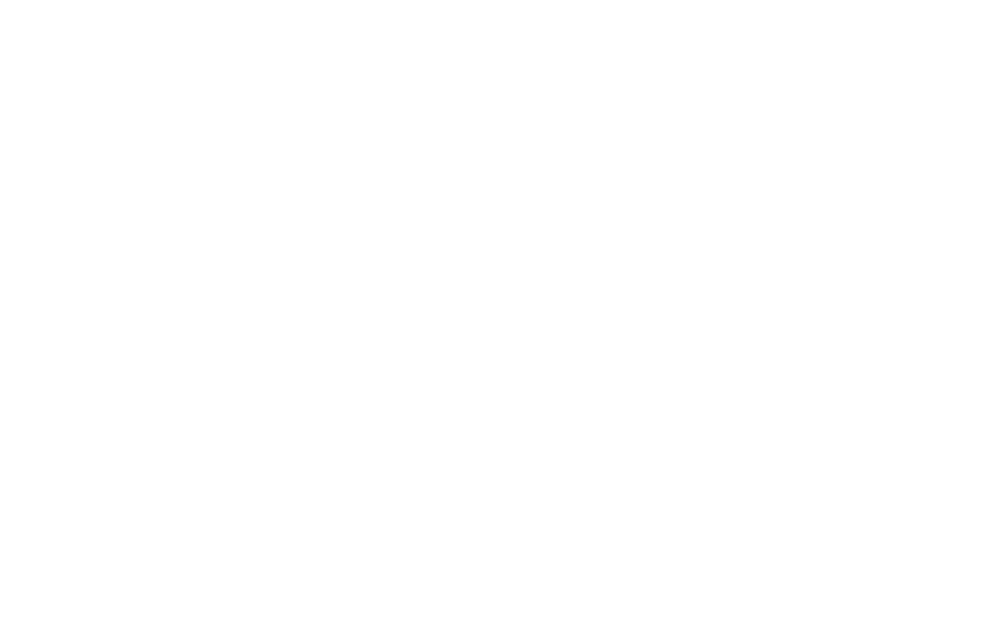

# MSI Keyboard for Linux

A simple Linux application to support several MSI keyboards.



## Supported devices

| Device | Connection |
| --- | --- |
| MSI Strike Pro | USB cable, 2.4 GHz receiver |

## Installation

Download the package for your distribution from
[GitHub Releases](https://github.com/kordax/msi-keyboard-app/releases).

Debian, Ubuntu, and Linux Mint:

```bash
sudo apt install ./msi-keyboard_0.0.1-1_amd64.deb
```

Fedora and other RPM-based distributions:

```bash
sudo dnf install ./msi-keyboard-0.0.1-1.x86_64.rpm
```

## Usage

Start the GUI:

```bash
msi-keyboard
```

Use the CLI:

```bash
msi-keyboard --cli
msi-keyboard --cli --battery
msi-keyboard --cli --battery --json
msi-keyboard --cli --logs
msi-keyboard --language ru
msi-keyboard upgrade
```

## Development

```bash
task build       # Incremental release build
task test        # Build and run tests
task run         # Build and run the GUI
task check       # Linters, tests, security, and sanitizers
task package     # Build DEB and RPM packages
task rebuild     # Full release rebuild
```
