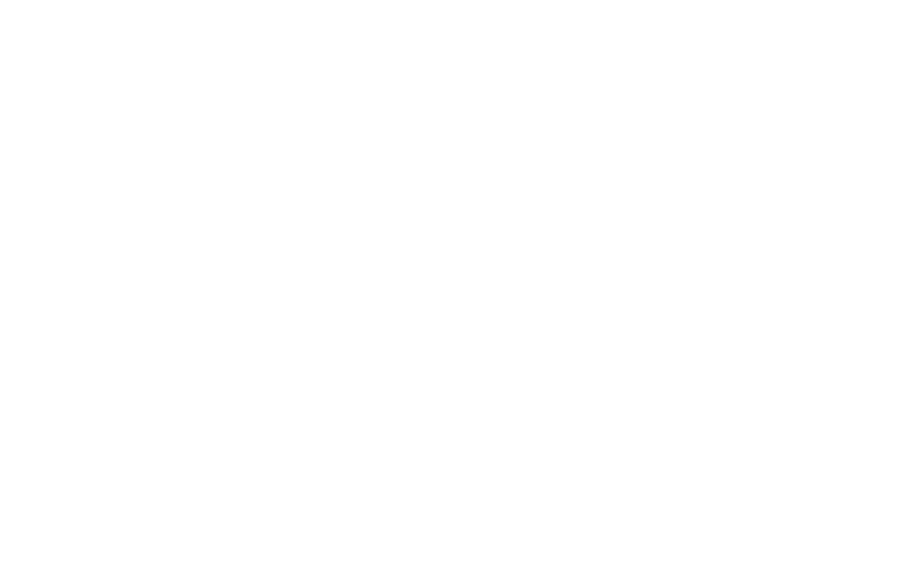

# MSI Keyboard for Linux

A simple Linux application to support several MSI keyboards with tray support.



## Supported devices

| Device | Connection |
| --- | --- |
| MSI Strike Pro | USB cable, 2.4 GHz receiver |

## Installation

Download the package for your distribution from
[GitHub Releases](https://github.com/kordax/msi-keyboard-app/releases).

Starting with version 0.1.2, the system package is named `msi-keyboard-app`.
APT removes an installed `msi-keyboard` package before installing this app.
This avoids accidentally upgrading an older project release to the unrelated
Ubuntu lighting tool that used the same package and command name.

Debian, Ubuntu, and Linux Mint:

```bash
sudo apt install ./msi-keyboard-app_0.1.3-1_amd64.deb
```

Fedora and other RPM-based distributions:

```bash
sudo dnf install ./msi-keyboard-app-0.1.3-1.x86_64.rpm
```

## Usage

Start the GUI:

```bash
msi-keyboard-app
```

Use the CLI:

```bash
msi-keyboard-app --cli
msi-keyboard-app --cli --battery
msi-keyboard-app --cli --battery --json
msi-keyboard-app --cli --logs
msi-keyboard-app --language ru
msi-keyboard-app upgrade
```

## Development

```bash
task build       # Incremental release build
task test        # Build and run tests
task run         # Build and run the GUI
task check       # Linters, tests, security, and sanitizers
task package     # Build DEB and RPM packages
task install     # Build and install the DEB package
task rebuild     # Full release rebuild
```
